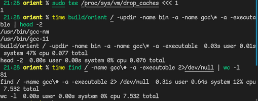

# orient

[简体中文](./README_zh.md)

A cross-platform filesystem indexer and searcher combining the merits of
`find`, `locate` and `Everything`, plus file content searches.
Works on Linux, macOS and Windows.

## Before you read

Inverted index, the tech behind `plocate` which make searches done in
near-constant time, **is implemented in `v0.4.0` and above**. Unfortunately
`v0.4` is not well tested, and the release is currently `v0.3.x`. Also, all
demostrations in the README are done on `v0.3.0`.
For personal computers which usually have less than 3M files, inverted index
does not make too much of a difference though.

*Content searches are not indexed.* Indexing file content indexing
will be worked on if this repo reached 512 stars, so smash that star
button if the app proves useful for you or if you find it interesting!  
(More about this [here](docs/TODO.md).)

This README is about the CLI application. For GUI frontend, see
[SearchEverywhere](https://github.com/cxxsucks/SearchEverywhere).
(also quite unstable)

This project started being worked on since August 2022, but was not published
until April 2023 due to countless bugs. There may still be countless bugs
currently though, even on stable version (`v0.3.x`).

## Unique Features

### Extremely Lightweight

The only runtime dependency is PCRE2, and a fully static executable is
only 2.5MiB in size (stripped).

### Linux, macOS and **Windows**

The First Libre File Indexer Ever on macOS and Windows!😜  

- Ignores macOS firmlink `/System/Volumes/Data` which tricks `find`
- Using native UTF-16 on Windows with minimal modification to code
    (via templates), achieving both performance and simplicity
- Handles Windows drives as if they were Unix directories
    (with '\\' being separator of course)

Screenshot on macOS and Windows respectively:  
  
  

### Non-root, multithreaded `updatedb` (SSD only)

Unlike `locate`, rebuild filesystem index requires **NO** root permission
(or Administrator on Windows). No setugid either.  
For SSDs, a thread pool is set up for concurrent directory reads,
drastically speeding up read speed.  
For HDDs, this feature shall be disabled, as multithreaded IO gives no
visible performance gains due to their spinning nature.  
Whether multithreaded `updatedb` shall be enabled can be toggled per path.

The figure shows that `orient` can scan 810000 files within 1 secs with
*cache dropped*, but the disk used is a rather high-end one. Take it with
a grain of salt though.  
  

### Rapid Fuzzy & Content matching

Like `updatedb`, the same thread pool is also used for content match.
Fuzzy matching `hello world` from the 75000-file Linux kernel source
tree took 5.5secs when cache dropped and 1.5secs with cache.  
  
(take with a grain of salt; 16x Intel i7 11800H and NVMe SSD)
> On Windows content matching is **significantly slower**, a combined
> effect of UTF8 to UTF16 conversion, lack of efficient kernel memory
> mapping (`mmap(2)`) and the bloated, inefficient nature of Windows.

~~Goodbye `find ... | xargs grep ...` and `find ... -a -exec grep ...`~~

### `find`-like syntax

As shown below, `orient` also implements **large portions of** `find`'s
matches, making users easy to familierze themselves with existing
experience in using `find` while also increasing the app's versatility.  


### Match parent dir or child file

Unlike `Everything` which hard code parent match to string matching only,
in `orient`, `-updir -downdir` can be applied to any predicate.

Also `-downdir` is almost 0 overhead and `-updir` make searches **even**
**faster** by caching recent matches.  
Matching Parent:  
  
Matching Children:  


## Comparison

|              | Linux | Windows | macOS | Android |   License   |
|:------------:|:-----:|:-------:|:-----:|:-------:|:-----------:|
| `Everything` | 👎NO  |  👍YES  | 👎NO  |  👎NO   | Proprietary |
|    `find`    | 👍YES |  👎NO   | 👎NO  |  👎NO   |    GPLv3    |
|  `fsearch`   | 👍YES |  👎NO   | 👎NO  |  👎NO   |    GPLv2    |
|   `locate`   | 👍YES |  👎NO   | 👎NO  |  👎NO   |    GPLv3    |
|   `orient`   | 👍YES |  👍YES  | 👍YES |  👎NO   |    GPLv3    |

Continued Table  
|              | `-and -or` | Invert Index | Match Parent |  GUI  |  CLI  |
|:------------:|:----------:|:------------:|:------------:|:-----:|:-----:|
| `Everything` |   👍YES    |     👎NO     |   Partial    | 👍YES |  😕   |
|    `find`    |   👍YES    |     👎NO     |     👎NO     | 👎NO  | 👍YES |
|  `fsearch`   |   👍YES    |     👎NO     |   Partial    | 👍YES | 👎NO  |
|   `locate`   |   👎NO     |     👍YES    |     👎NO     | 👎NO  | 👍YES |
|   `orient`   |   👍YES    |     👍YES    |     👍YES    | 👍YES | 👍YES |

Notes:

- *Partial*ly matching parent and children means while they do provide
    options to match a file's parent or dir's children, such searches are
    confined to string matches instead of all the app's features.
- `Everything` CLI seems to have all results *prettified*, making it very
    hard to use in combination with other tools, hence the 😕 face.
- `eVeRyThInG` iS pRoPrIeTaRy, OnLy SdK pRoViDeD!!! OuR dEaR lEaDeR rIcHaRd
    StAlLmAn WiLl NuKe it!!!
    > What's worse, `Everything SDK` is filled with global states.🤮

## Quick Start

### Use `find`-like Syntax

Users who are familiar with `find` could jumpstart with `orient`'s `find`
compatible predicates, like `-regex`, `-lname`, `-okdir` and others.  
Note that `orient` predicates are sometimes superset of their `find`
counterparts, like `-quit` optionally accepts a integer argument meaning
how many results can be produced before quitting. Its default value is 1
so that when using `-quit` with no arguments it has no difference from
that in `find`.  

For predicates specific to `orient`, only `orient`-style syntax is
provided, see below.

```sh
# mp3 or mp4 file excluding under hidden dirs
find ~ \( -name ".*" -a -prune -a -false \) -o -name "*.mp[34]"
orient ~ \( -name ".*" -a -prune -a -false \) -o -name "*.mp[34]"

# Ask user to whether to show its realpath when a symlink found in /usr
# until user inputs "yes" (realpath executes)
find /usr -type l -a -okdir realpath \{\} \; -a -quit
orient /usr -type l -a -okdir realpath \{\} \; -a -quit
# Until 2 user inputs "yes"
orient /usr -type l -a -okdir realpath \{\} \; -a -quit 2
# Even better, -quitmod
orient /usr -quitmod \( -type l -a -okdir realpath \{\} \; \)
# -quit -quitmod has some quirks; see docs/predicates.md
```

## Use `orient`'s Alternative Syntax

`orient` does not have as much (unique) predicates as `find`. Instead,
`orient` use `-PRED --ARG` syntax, giving multiple matching schemes to
a single predicate, boosting code reuseability.

- Path match predicates: `-name` `-bregex` `-strstr` `-fuzz`  
    Arguments: `--ignore-case`(except `-fuzz`) `--full` `--readlink`
- Content match predicates: `-content-{strstr,fuzz,regex}`  
    Arguments: `--ignore-case`(except fuzz) `--blocked` `--allow-binary`
- File stat predicates: `-size` `-{a,m,c}{time,min}` `-inum`  
    Arguments: File name or integer prefixed by `+` or `-`
- and more...

Many `find` compatible predicates are actually aliases, like  
`-lname` is identical to `-name --readlink`  
`-regex` - `-bregex --ignore-case` (the `b` stands for basename)  
`-samefile` is basically `-inode` since `-inode` also accepts filename  
> It is also possible to mix two syntaxes together, though unrecommended  
> like `-iname --full` or `-anewer +5`

Below are some simple examples.
See more on how to use them [here](docs/predicates.md).

```sh
# Find C source files containing "hello"; orient style only
orient / -content-strstr hello -name "*.c"

# Many `find` style predicates are actually aliases, ex:
orient / -iname "*.cpp" # find style
orient / -name --ignore-case "*.cpp" # orient style

# Assuming /home/a/b links to /var/tmp, then
# all the following 3 lines matches /home/a/b
# `-lname` is identical to `-name --readlink`  
orient / -lname "*tmp"
orient / -name --readlink "*tmp"
# `orient` style is more versatile:
orient / -bregex --readlink 'tmp$' # No `find` style alternative
```

### Modifiers

With the introduction of modifier predicates, it is possible to "do
something" before propagating to other preds, which is exactly what
`-updir` and `-downdir` does: they match the parent of files and
children of directories.  
With modifiers, `-updir -downdir` can be applied to any predicate
in `orient`, unlike `Everything` which hard code parent match to string
matching only.  
*Any* predicate includes recursive use of `-updir -downdir` themselves.

Also `-downdir` is almost 0 overhead and `-updir` make searches **even**
**faster** by caching recent matches.

Some more modifiers include `-prunemod`, `-quitmod` and `-not`. Ex:  

```sh
# Find bin/gcc*
orient / -updir -name "gcc*" -a -executable
# Find bin/gcc* or bin/clang*
orient / -updir \( -name "gcc*" -o -name "clang*" \) -a -executable

# Find git repositories, first level only
orient / -downdir \( -name .git -a -type d \) -a -prune
# Must use -exec test on find and is extremely slow
find .. -type d -a -exec test -d '{}/.git' \; -a -print -a -prune

# .cc files under src directory of a git repository
orient / -updir \( -name src -a -updir -downdir -name .git \) -name "*.cc"
```

## Installation

Since the application is a CLI, simply grab the executable of your system
and it should work.
> On Linux, `-user -nouser -group -nogroup` require glibc to work.  

Unfortunately the macOS ARM version is missing since I don't have one such
machine🫥. Feel free to report whether it works on issue or discussion.
> Currently this app is too little-tested to release to a distribution.  
> May release to Arch AUR first btw.

### Build From Source

Building from source is recommended in the early stage of release.
Give it a shot! (Required for `v0.4.0`)  
Or even better, build both `orient` and
[SearchEverywhere](https://github.com/cxxsucks/SearchEverywhere).
By building `SearchEverywhere`, `orient` also gets built.
Build dependencies:

- CMake
- PCRE2
- rapidfuzz
- GoogleTest (Test Only)

Aside from `CMake`, all dependency can be auto-downloaded by CMake.  
Using an installed one is also possible, should you have already
installed some of them onto your system, via toggling these configure
options below.

Configure Options:

- `ORIE_TEST`: Build GoogleTest test suites
- `ORIE_SYSTEM_PCRE2`: Use System PCRE2 Library instead of compiling
    a new one.
- `ORIE_LINK_STATIC`: Statically link orient executable
- `ORIE_SYSTEM_RAPIDFUZZ`: Use System rapidfuzz Library (header only)

Replace the `OPTION` below with your enabled options, and run the
following commands:

```sh
git clone https://github.com/cxxsucks/orient.git
cd orient; mkdir build; cd build
cmake -DOPTION1=ON -DOPTION2=ON -DCMAKE_BUILD_TYPE=Release ..
make -j$(nproc)
sudo make install
```

## Caveats

### Multithreaded Read by Default

Default config generation hard-codes some starting points and enables
multithreaded read on all of them, which is suboptimal for rotational
hard disks.  
If you happen to use HDDs, do the following the first time running `orient`:

1. Run `orient -updatedb`
2. Immediately interrupt with `Ctrl-C`
3. Open `~/.config/orie/default.txt` or `%APPDATA%\.orie\default.txt`
4. Review the paths succeeding `ROOT`, remove the `SSD` field if any of
    these paths are actually not on SSD.
5. If there are any HDD root paths not listed, write
    `ROOT "/path/to/mountpoint"` or simply do not index it with
    `IGNORED "/path/to/mountpoint"`.

On Linux, `/sys/block/sda/queue/rotational` provide insights on whether
a disk is rotational, which macOS and Windows unfortunately (but
expectedly) do not have.  
In a future release root points will be aquired from `/etc/mtab` and
`/sys/.../rotational`, which auto-configure root paths on Linux and macOS.
> ApPlE iS sO cOoL! tHeY mUsT hAvE eQuIpPeD tHeIr MaCbOoKs WiTh ThE bEsT
> hArD dIsKs In ThE wOrLd AnD iS dEfInItElY nOt RoTaTiOnAl!

### Untested features

The `exec` series of predicates are implemented, but not tested, on Windows.  
And a moderate amount of software engineering experience would tell that
untested features would certainly contain errors, if not fail outright.

There are a number of untested features, with `exec` on Windows being the
only one actually listed in [feature list](docs/predicates.md).  
Other untested features are listed in [TODO list](docs/TODO.md), but not
feature list, along with reasons why they are not tested.

### **Unimplemented** `find` features

Mostly global options:

- `-context` (SELinux context)
- `-printf -fprintf -ls -fls` (Format print)
- `-newerXY`
- `-mindepth` `-maxdepth`
- `-H -L -P` (symlink following global options)
- `-D` (debugopts)
- `-O` (optimize level)
    > `orient` has its own optimizer similar to `find -O3`
- `-regextype` (hardcoded PCRE2)
- `-warn -nowarn`
- `-d -depth` (depth first search)
    > `orient` can only search according to index.
    > `-delete` is not affected though, unlike `find`.
- `-files0-from`
- `-mount -xdev -xautofs` (do not descend into mounts)
- `-help -version`

## Future Work

Documentations would be the center of works recently.  
Bug reports and feature request are still accepted anyway, in GitHub Issues
Tracker of this repository.  
See [TODO List](docs/TODO.md) for details.

## Credits

- [dirent](https://github.com/tronkko/dirent): Unix `dirent` port to Windows
    > Heavily modified here for symlink and (fake) device, socket support,
    > therefore it is directly placed into source instead of module.
- [PCRE2](https://github.com/PCRE2Project/pcre2) Regular Expression
- [rapidfuzz-cpp](https://github.com/maxbachmann/rapidfuzz-cpp):
    **Header Only** Fuzzy string matching library
